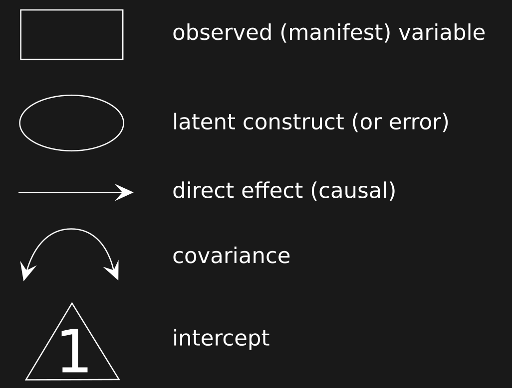
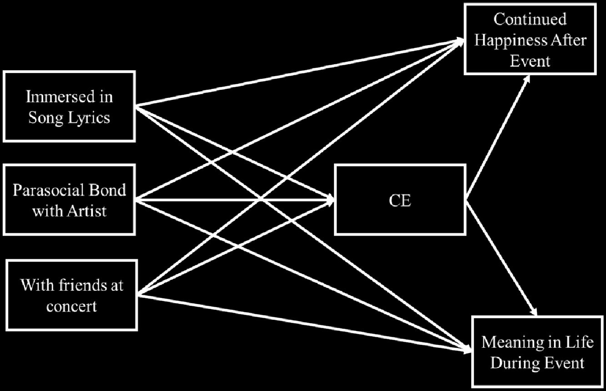
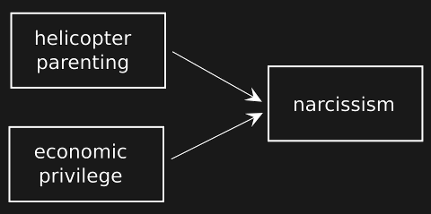
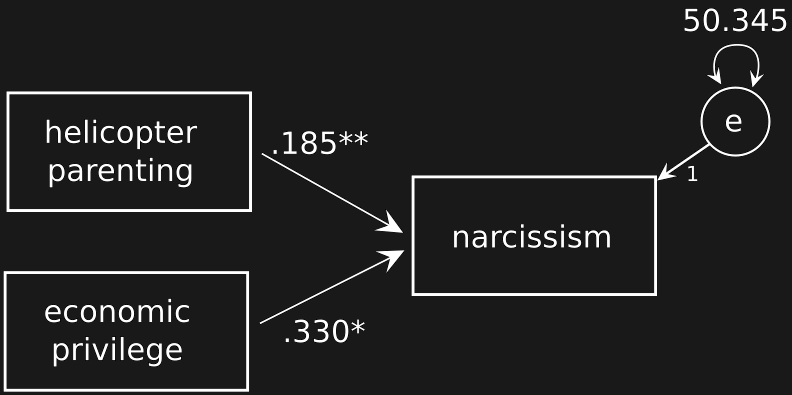
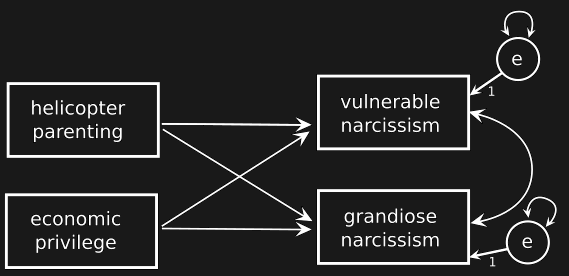
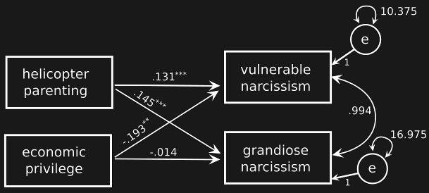

```{r}
#| label: setup
#| include: false
options(tidyverse.quiet=TRUE)
theme_jetblack <- function(base_size = 12, base_family = "") {
  ggplot2::theme_grey(base_size = base_size, base_family = base_family) %+replace%
    ggplot2::theme(
      # Specify axis options
      axis.line = ggplot2::element_blank(),
      axis.text.x = ggplot2::element_text(
        size = base_size * 0.8,
        color = "white",
        lineheight = 0.9
      ),
      axis.text.y = ggplot2::element_text(
        size = base_size * 0.8,
        color = "white",
        lineheight = 0.9
      ),
      axis.ticks = ggplot2::element_line(
        color = "white",
        size = 0.2
      ),
      axis.title.x = ggplot2::element_text(
        size = base_size,
        color = "white",
        margin = margin(
          0, 10, 0,
          0
        )
      ),
      axis.title.y = ggplot2::element_text(
        size = base_size,
        color = "white", angle = 90,
        margin = margin(
          0, 10, 0,
          0
        )
      ),
      axis.ticks.length = ggplot2::unit(0.3, "lines"),
      # Specify legend options
      legend.background = ggplot2::element_rect(
        color = NA,
        fill = "black"
      ),
      legend.key = ggplot2::element_rect(
        color = "white",
        fill = "black"
      ),
      legend.key.size = ggplot2::unit(1.2, "lines"),
      legend.key.height = NULL,
      legend.key.width = NULL,
      legend.text = ggplot2::element_text(
        size = base_size * 0.8,
        color = "white"
      ),
      legend.title = ggplot2::element_text(
        size = base_size * 0.8,
        face = "bold", hjust = 0,
        color = "white"
      ),
      legend.position = "right",
      legend.text.align = NULL,
      legend.title.align = NULL,
      legend.direction = "vertical",
      legend.box = NULL,

      # Specify panel options
      panel.background = ggplot2::element_rect(
        fill = "black",
        color = NA
      ),
      panel.border = ggplot2::element_rect(fill = NA, color = "white"),
      panel.grid.major = ggplot2::element_line(color = "grey35"),
      panel.grid.minor = ggplot2::element_line(color = "grey20"),
      # panel.margin = ggplot2::unit(0.5, "lines"),

      # Specify facetting options
      strip.background = ggplot2::element_rect(
        fill = "grey30",
        color = "grey10"
      ),
      strip.text.x = ggplot2::element_text(
        size = base_size * 0.8,
        color = "white"
      ),
      strip.text.y = ggplot2::element_text(
        size = base_size * 0.8,
        color = "white",
        angle = -90
      ),
      # Specify plot options
      plot.background = ggplot2::element_rect(
        color = "black",
        fill = "black"
      ),
      plot.title = ggplot2::element_text(
        size = base_size * 1.2,
        color = "white"
      ),
      plot.margin = ggplot2::unit(rep(1, 4), "lines")
    )
}

scale_colour_discrete <- function(...) {
  scale_colour_manual(..., values = viridis::viridis(2))
}

options(ggplot2.continuous.colour="viridis")
options(ggplot2.continuous.fill = "viridis")
```

## part II

| lecture                  | topic                                 |
|--------------------------|---------------------------------------|
| 6                        | introduction to multivariate analysis |
| [7]{style="color:blue;"} | [path analysis]{style="color:blue;"}  |
| 8                        | mediation models                      |
| 9                        | confirmatory factor analysis          |

# multivariate analysis

- more than one response variable (or DV)
- focus on causal relationships / patterns of associations between variables
- modeling framework: Structural Equation Models (SEM)
  - [structural model]{style="color:yellow;"}: path / mediation analysis
  - [measurement model]{style="color:yellow;"}: CFA, full SEM

## model diagram syntax

{fig-align="center" width="60%"}

::: {.aside}
"McArdle-McDonald RAM syntax"
:::

## model specification {.smaller}

represent your hypotheses as equations or (more commonly) as a path diagram

::: {.spacious-list}

- [**endogenous variable**]{style="color:yellow;"}: one or more causal paths leading into it

- [**intervening variable**]{style="color:yellow;"}: one or more causal path leading in and one or more leading out

- [**exogenous variable**]{style="color:yellow;"}: one or more causal path leading out, none leading in

:::

## recursive vs non-recursive models

Criteria for a [recursive]{style="color:yellow;"} model:

::: {.spacious-list}

- causality is unidirectional

- disturbances (errors) are independent

:::

## path diagrams {.smaller}

{fig-align="center" width=70%}

::: {.aside}
Koefler et al. (2024), [Let the music play: Live music fosters collective effervescence and leads to lasting positive outcomes](https://doi.org/10.1177/01461672241288027). *Personality and Social Psychology Bulletin*.
:::

::: {.notes}

mention: exogenous vs. endogenous

CE ~ immersed + parasocial + friends
CHAE ~ CE + immersed + parasocial
MIL ~ CE + parasocial

:::

## model identification {.smaller}

- analyzing a SEM requires estimating parameters in a set of *simultaneous equations*
- a parameter is 'identified' if a unique value can be found given the model + data matrix

| Term                             | Description                         |
|----------------------------------|-------------------------------------|
| *under-identified*               | at least one unidentified parameter |
| *just-identified* or *saturated* | data complexity = model complexity  |
| *over-identified*                | model simpler than data             |

- no. unique entries in the data matrix ($n$ = no. measured vars)

$$\frac{n(n + 1)}{2}$$

::: {.notes}

a model is
- under-identified: contains at least one unidentified param (model too simple for the data)
- just-identified or saturated (model 'just right' for the data); usually scientifically vapid
- over-identified (model simpler than the data; can be disconfirmed)

example:
- fitting a line to a single point
- fitting a line to two points
- fitting a line to 10 points

identification should be done /before/ collecting any data; it is a function of the number of measures (variables) and the structure of the model, NOT the sample size!

:::

## multiple regression as a path model

{fig-align="center" width="50%"}

::: {.aside}
NB: this is based on simulated data and poor domain knowledge!
:::

## 

- download the [`narc_1.csv`](../data/narc_1.csv) dataset

```{r}
#| echo: false
library("tidyverse")

dat <- read_csv("../data/narc_1.csv", col_types = "ddd")
dat
```

## using lavaan

The lavaan package uses the `lavaan()` function to fit models. However, there are two simpler interface models that are more useful for beginners.

| function | description                        |
|----------|------------------------------------|
| `sem()`  | Fit a structural equation model    |
| `cfa()`  | Fit a confirmatory factor analysis |

## syntax for structural model

- like `lm()` formula, but multi-line and in quotes

```
mod_formula <- '
# this is a comment!
# direct effects
y1 ~ x1 + x2
y2 ~ x1 + x3

# covariances
y1 ~~ y2  # estimate y1's covariance with y2
y1 ~~ y1  # disturbance variance for y1
y2 ~~ y2  # disturbance variance for y2
'

mod_fit <- sem(mod_formula, data = dat)
```

## useful additional functions {.smaller}

| function               | description                                                                                                                                           |
|------------------------|-------------------------------------------------------------------------------------------------------------------------------------------------------|
| `parTable()`           | show parameters being estimated                                                                                                                       |
| `parameterEstimates()` | show all parameter estimates in a table                                                                                                               |
| `summary()`            | model parameters and statistics; `fit.measures=TRUE` for measures of fit, `standardized=TRUE` to get standardized estimates, `rsquare=TRUE` for $R^2$ |

## output from `sem()` {.smaller}

:::: {.columns}

::: {.column width=50%}

```{r}
library("lavaan")

mod_fit <- sem('Narc ~ HP + EP', data = dat)

summary(mod_fit)
```

:::

::: {.column width=50%}


:::

::::

## compare to multiple regression {.smaller}

:::: {.columns}

::: {.column width=60%}


```{r}
#| echo: false
lm(Narc ~ HP + EP, data = dat) |>
  summary()
```

:::

::: {.column width=40%}



:::

::::

## adding a second DV

{fig-align="center" width=70%}

::: {.aside}
download [narc_2.csv](../data/narc_2.csv)
:::

## output from `sem()` {.smaller}

:::: {.columns}

::: {.column width=50%}

```{r}
dat2 <- read_csv("../data/narc_2.csv",
                 col_types = "dddd")

mod_syx <- '
VN ~ HP + EP
GN ~ HP + EP'

mod_fit2 <- sem(mod_syx, data = dat2)

summary(mod_fit2)
```

:::

::: {.column width=50%}


:::

::::

## compare to multiple regression {.smaller}

:::: {.columns}

::: {.column width=60%}


```{r}
#| echo: false
lm(cbind(VN, GN) ~ HP + EP, data = dat2) |>
  summary()
```

:::

::: {.column width=40%}



:::

::::

## model measures of fit

| fit measure                                     | heuristic |
|-------------------------------------------------|-----------|
| $X^2$ $p$-value                                 | $>.05$    |
| Root Mean Square Error of Approximation (RMSEA) | $<.08$    |
| Comparative Fit Index (CFI)                     | $>.95$    |
| Standardized Root Mean Square Residual (SRMR)   | $<.08$    |

::: {.aside}

use `summary(mod_fit, fit.measures=TRUE)` to obtain, only with an over-identified model; see Klein (2023) for extensive discussion

:::

## assumptions

- assumptions inherited from multiple regression:
  - all direct effects reflect linear relationships
  - exogenous variables measured without error
  - residuals normally distributed
  
- in psychology, these assumptions are *almost never* satisfied
  - alternative: piecewise (or local-estimation) SEM

::: {.aside}
see Klein (2023) for discussion
:::
