```{r}
#| label: setup
#| include: false
options(tidyverse.quiet=TRUE)
library("tidyverse")
```

## part II

| lecture | topic                                                 |
|---------|-------------------------------------------------------|
| 6       | introduction to multivariate analysis                 |
| 7       | path analysis                                         |
| 8       | mediation models                                      |
| 9       | [confirmatory factor analysis]{style="color:blue;"} |
| --      | practical skills assessment 2                         |

## what is CFA? {.smaller}

> "a type of SEM that deals specifically with measurement models—that is, the relationships between observed measures or *indicators* (e.g., test items, test scores, behavioral observation ratings) and latent variables or *factors*." 

- hypothesis-driven, not data-driven
  - vs *exploratory factor analysis* (EFA), principal components analysis (*PCA*)

::: {.aside}

Brown, T. A. (2015). Confirmatory factor analysis for applied research (2nd edition). New York: Guilford Press.

:::

## when is it useful? 

- later stages of scale development (vs EFA)
- psychometric evaluation of test instruments
- full SEM
  - forms the 'measurement' part of the model (vs. structural)

## psychometric evaluation

- estimate scale reliability (vs Cronbach's alpha)
- assess *construct validity*
  - *convergent* validity
  - *discriminant* validity
- measurement invariance (multigroup CFA)
- accounting for "method" effects
  - additional non-factor covariation introduced by the measurement approach

## Holzinger & Swineford {.smaller}

| variable | description                                                      |
|----------|------------------------------------------------------------------|
| `x1`     | Visual perception test from Spearman VPT Part I                  |
| `x2`     | Cubes, Simplification of Brighams Spatial Relations Test         |
| `x3`     | Lozenges from Thorndike-Shapes flipped over then identify target |
| `x4`     | Paragraph comprehension                                          |
| `x5`     | Sentence completion                                              |
| `x6`     | Word meaning                                                     |
| `x7`     | Speeded addition                                                 |
| `x8`     | Speeded counting of dots                                         |
| `x9`     | Speeded discrimination of straight and curved capitals           |

::: {.aside}

Holzinger, K. J., & Swineford, F. (1939). A study in factor analysis: The stability of a bi-factor solution. *Supplementary Educational Monographs*, xi + 91.

:::

::: {.notes}

cognitive testing of schoolchildren: 11-16 year old kids

:::

## Holzinger & Swineford data

```{r}
library("lavaan")
library("tidyverse")

HolzingerSwineford1939 |>
  as_tibble()
```

## Holzinger & Swineford data

```{r}
HolzingerSwineford1939 |>
  summary()
```

## CFA diagram {.smaller}

:::: {.columns}

::: {.column width="50%"}

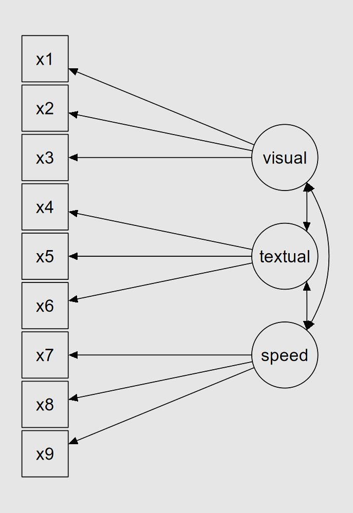{fig-align="center" width="65%"}

:::

::: {.column width="50%"} 

- account for measurement error
- unidimensional measurement
  - "loadings"
- "reflective" measurement (vs. formative)
- common vs. unique variance

:::

::::

## model identification

:::: {.columns}

::: {.column width="50%"}

{fig-align="center" width="65%"}

:::

::: {.column width="50%"} 

- single factor: >2 X vars
- two factors: $\ge$ 2 Xs per F

- latent var identification:
  1. reference indicator
  2. unit variance

:::

::::

## estimation in lavaan {.smaller}

:::: {.columns}

::: {.column width="40%"}

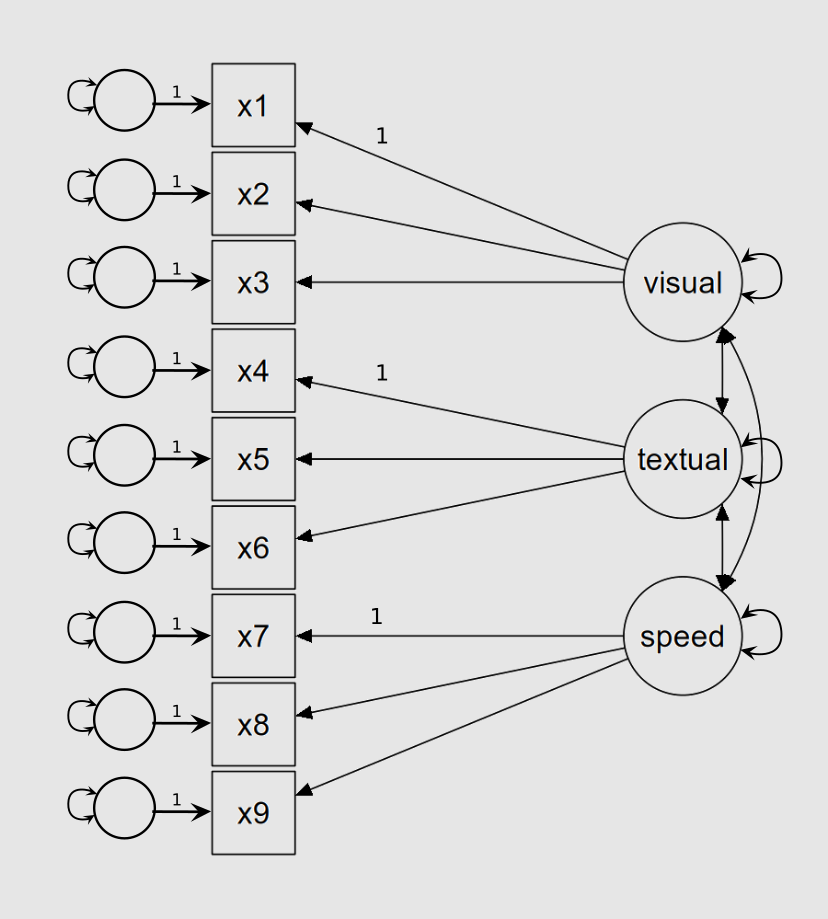{fig-align="center"}

:::

::: {.column width="60%"}

```{r}
#| label: hs-unstandard
#| echo: true
library("lavaan")

mod_hs <- '
visual  =~ x1 + x2 + x3
textual =~ x4 + x5 + x6
speed   =~ x7 + x8 + x9
'

fit_hs <- cfa(mod_hs, data = HolzingerSwineford1939)

summary(fit_hs, fit.measures = TRUE)
```
:::

::::

## model measures of fit {.smaller}

| fit measure                                     | heuristic |
|-------------------------------------------------|-----------|
| $X^2$ $p$-value                                 | $>.05$    |
| Root Mean Square Error of Approximation (RMSEA) | $<.08$    |
| Comparative Fit Index (CFI)                     | $>.95$    |
| Standardized Root Mean Square Residual (SRMR)   | $<.08$    |

- how can we improve the fit?
  - allow cross loadings
  - allow indicator covariance

## `modificationIndices()` {.smaller}

```{r}
modificationIndices(fit_hs) |>
  as_tibble() |>
  print(n = +Inf)
```

## `modificationIndices()` {.smaller}

```{r}
modificationIndices(fit_hs) |>
  as_tibble() |>
  arrange(desc(mi)) |>
  print(n = +Inf)
```

## `modificationIndices()` {.smaller}

```{r}
modificationIndices(fit_hs) |>
  as_tibble() |>
  filter(op == "~~") |>
  arrange(desc(mi)) |>
  print(n = +Inf)
```

## updating the model {.smaller}

:::: {.columns}

::: {.column width="40%"}

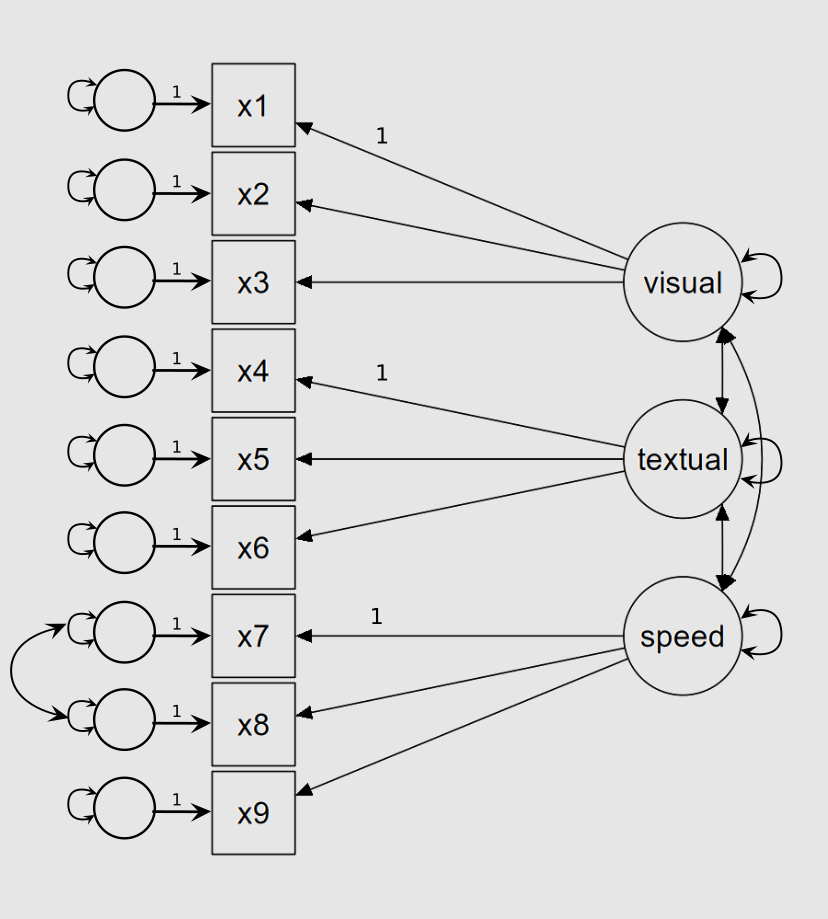{fig-align="center"}

:::

::: {.column width="60%"}

```{r}
#| label: hs-unstandard2
#| echo: true
mod_hs2 <- '
visual  =~ x1 + x2 + x3
textual =~ x4 + x5 + x6
speed   =~ x7 + x8 + x9

## suggested by modificationIndices()
x7 ~~ x8
'

fit_hs2 <- cfa(mod_hs2, data = HolzingerSwineford1939)

summary(fit_hs2, fit.measures = TRUE)
```
:::

::::

## comparing models 

- use the `anova()` function (THIS IS NOT AN ANOVA!!) to compare the parent model to the nested model

```{r}
anova(fit_hs, fit_hs2)
```

## standardizing latent variables {.smaller}

:::: {.columns}

::: {.column width="40%"}

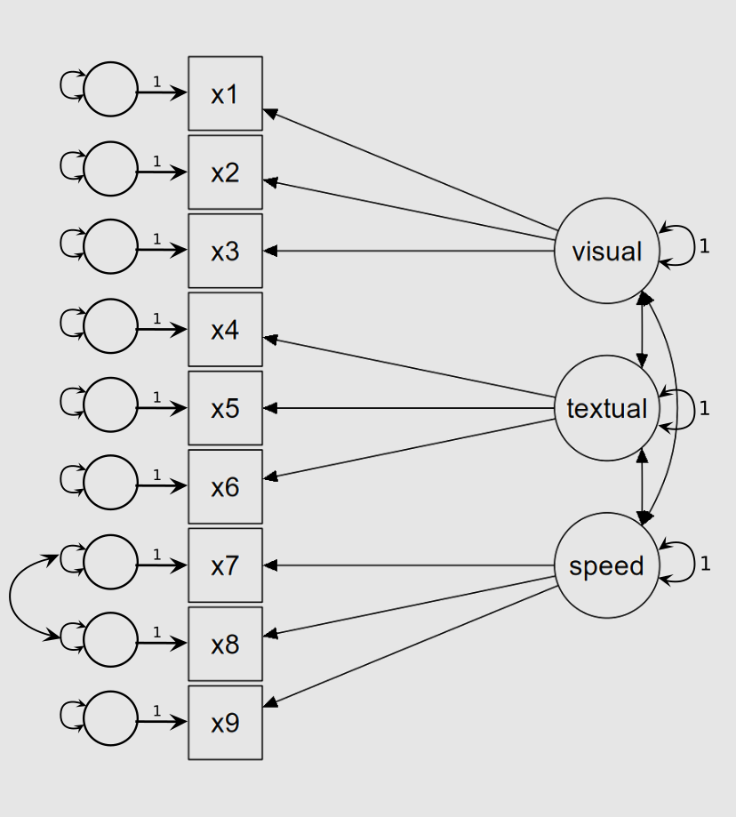{fig-align="center"}

:::

::: {.column width="60%"}

```{r}
#| label: hs-standard
#| echo: true
fit_hs2_stdlv <- cfa(mod_hs2, data = HolzingerSwineford1939,
                     std.lv = TRUE)

summary(fit_hs2_stdlv, fit.measures = TRUE)
```
:::

::::

## {.smaller}

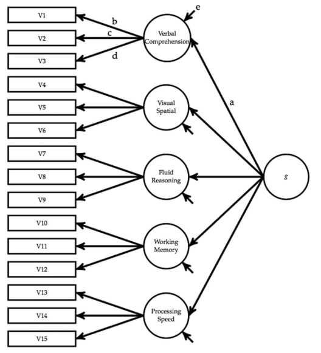{fig-align="center"}

::: {.aside}

Beaujean, A. A., Parkin, J., & Parker, S. (2014). Comparing Cattell–Horn–Carroll factor models: Differences between bifactor and higher order factor models in predicting language achievement. *Psychological Assessment*, 26(3), 789–805. https://doi.org/10.1037/a0036745

:::

## MIMIC {.smaller}

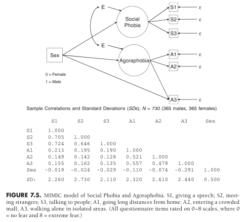{fig-align="center"}

::: {.aside}

Brown, T. A. (2015). Confirmatory factor analysis for applied research (2nd edition). New York: Guilford Press.

:::

## tips for PSA2 {.smaller}

- have a backup plan (<https://posit.cloud/>, psych rstudio server)
- make sure you know how to:
  - download materials from 'feedback files' section on Moodle
  - **put all downloaded materials in same directory as the R Markdown stub file, and use the same filenames as on Moodle**
  - answer an MCQ question by forming a vector
    - GOOD: `mcq_answer <- c("a", "c")`
    - BAD: 
      - `mcq_answer <- "a and c"`
	  - `mcq_answer <- c(a, c)` (error)
  - type in a lavaan model formula (without fitting)
- knit for better presentation of the questions
- make sure *all* validation tests pass before submitting
- double check your submission before finalizing

# further reading & learning

## data wrangling {.smaller}

:::: {.columns}

::: {.column width="50%"}

{width="70%" fig-align="center"}

:::

::: {.column width="50%"}

- website at <https://r4ds.hadley.nz/>

:::

::::

## multiple regression {.smaller}

:::: {.columns}

::: {.column width="50%"}

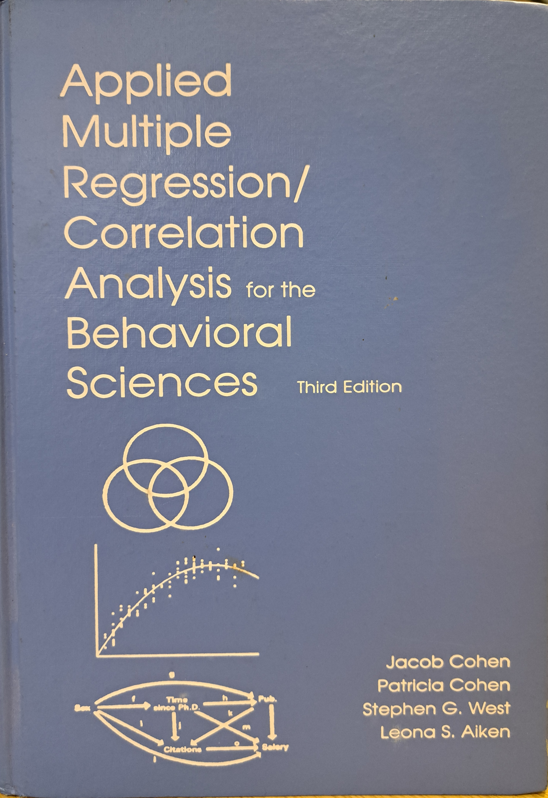{width="70%" fig-align="center"}

:::

::: {.column width="50%"}

Cohen, J., Cohen, P., West, S. G., & Aiken, L. S. (2013). Applied multiple regression/correlation analysis for the behavioral sciences. Routledge

:::

::::

## mixed-effects modeling {.smaller}

:::: {.columns}

::: {.column width="50%"}

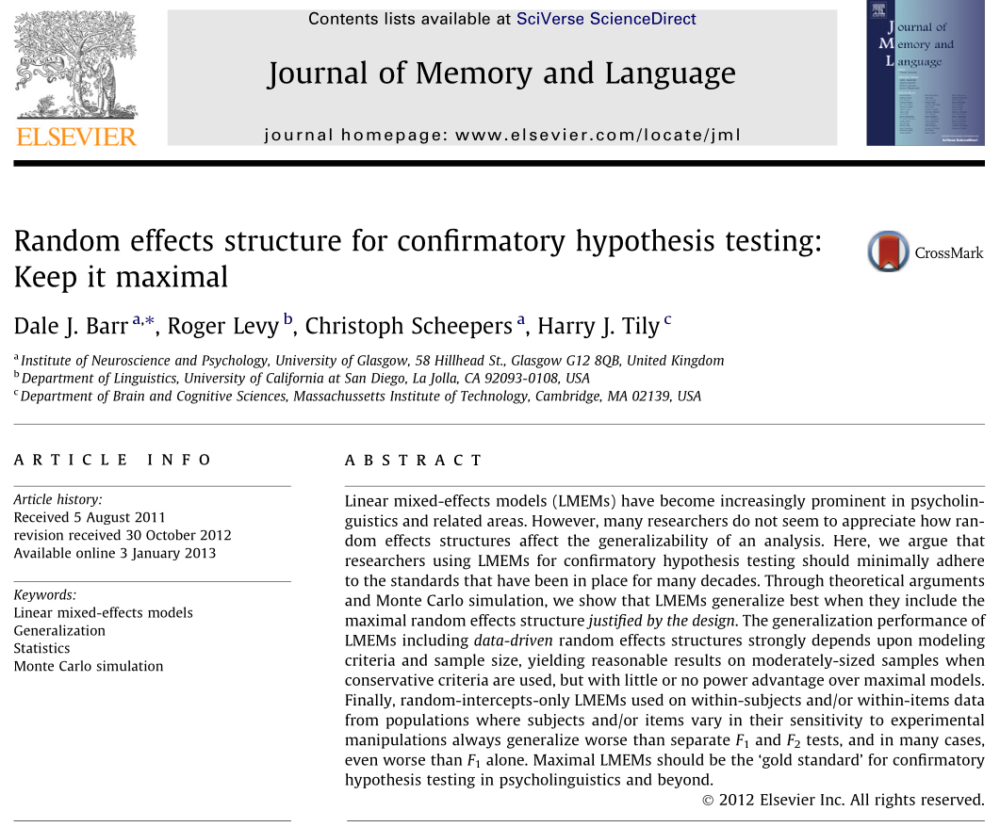{width="70%" fig-align="center"}

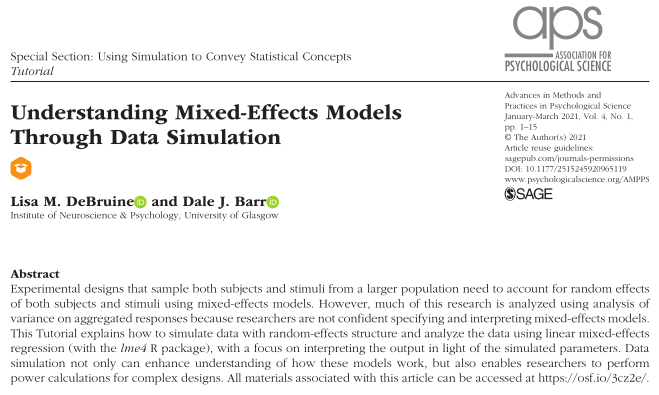{width="80%" fig-align="center"}

:::

::: {.column width="50%"}

Barr, D. J., Levy, R., Scheepers, C., & Tily, H. J. (2013). Random effects structure for confirmatory hypothesis testing: Keep it maximal. *Journal of Memory and Language*, 68, 255-278.

DeBruine, L. M., & Barr, D. J. (2021). Understanding mixed-effects models through data simulation. Advances in Methods and Practices in Psychological Science, 4(1), 2515245920965119.

:::

::::

## bayesian approaches

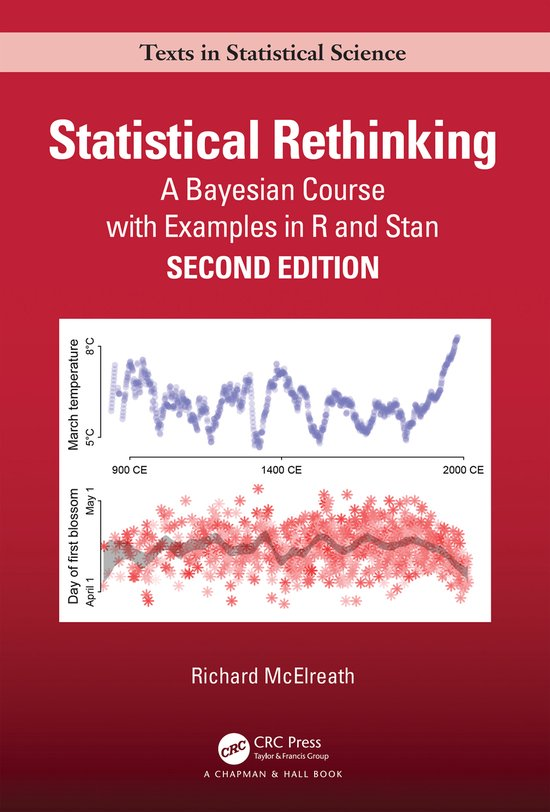{fig-align="center" width="60%"}


## generalized linear models {.smaller}

- for discrete data:

| type of data         | approach                                          |
|----------------------|---------------------------------------------------|
| nominal, dichotomous | logistic regression                               |
| nominal, polytomous  | baseline-category multinomial logistic regression |
| ordinal              | cumulative link mixed models (ordinal regression) |
| count                | Poisson regression                                |

- Bürkner & Vuorre (2019), [Ordinal regression models in psychology: A tutorial.](https://journals.sagepub.com/doi/full/10.1177/2515245918823199)
- Winter & Bürkner (2021), [Poisson regression for linguists](https://compass.onlinelibrary.wiley.com/doi/full/10.1111/lnc3.12439)
- Kumle, Võ, Draschkow (2021). [Estimating power in (generalized) linear mixed models](https://link-springer-com.ezproxy1.lib.gla.ac.uk/article/10.3758/s13428-021-01546-0)
- see also <https://psyteachr.github.io/stat-models-v1/generalized-linear-mixed-effects-models.html>

## analyzing time-series data

:::: {.columns}

::: {.column width="34%"}

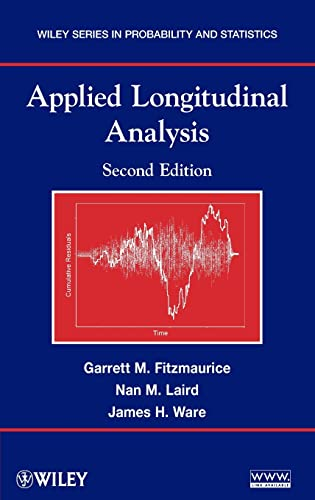

:::

::: {.column width="33%"}

{fig-align="center" width="120%"}

:::

::: {.column width="33%"}

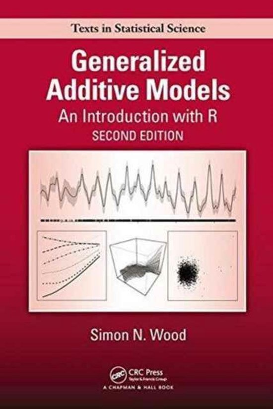

:::

::::

## structural equation modeling {.smaller}

:::: {.columns}

::: {.column width="50%"}

{width="70%" fig-align="center"}

:::

::: {.column width="50%"}

Klein (2023), [Principles and Practice of Structural Equation Modeling](https://www.guilford.com/books/Principles-and-Practice-of-Structural-Equation-Modeling/Rex-Kline/9781462551910), 5th Ed. New York: The Guilford Press.

:::

::::

## confirmatory factor analysis {.smaller}

:::: {.columns}

::: {.column width="50%"}

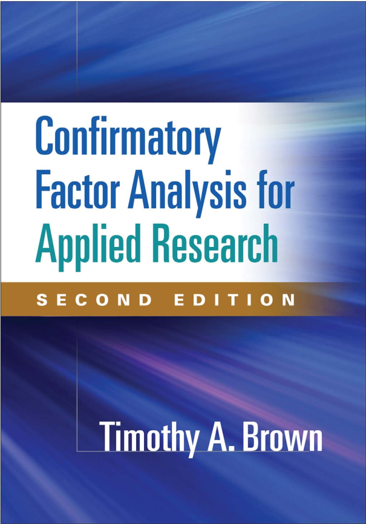{width="70%" fig-align="center"}

:::

::: {.column width="50%"}

Brown, T. A. (2015). Confirmatory factor analysis for applied research (2nd edition). New York: Guilford Press.

:::

::::

## level 4 options

- analysis of psychometric data (Christoph Scheepers)
- bootstrapping (Guillaume Rousselet)

# *thanks, and good luck!*
